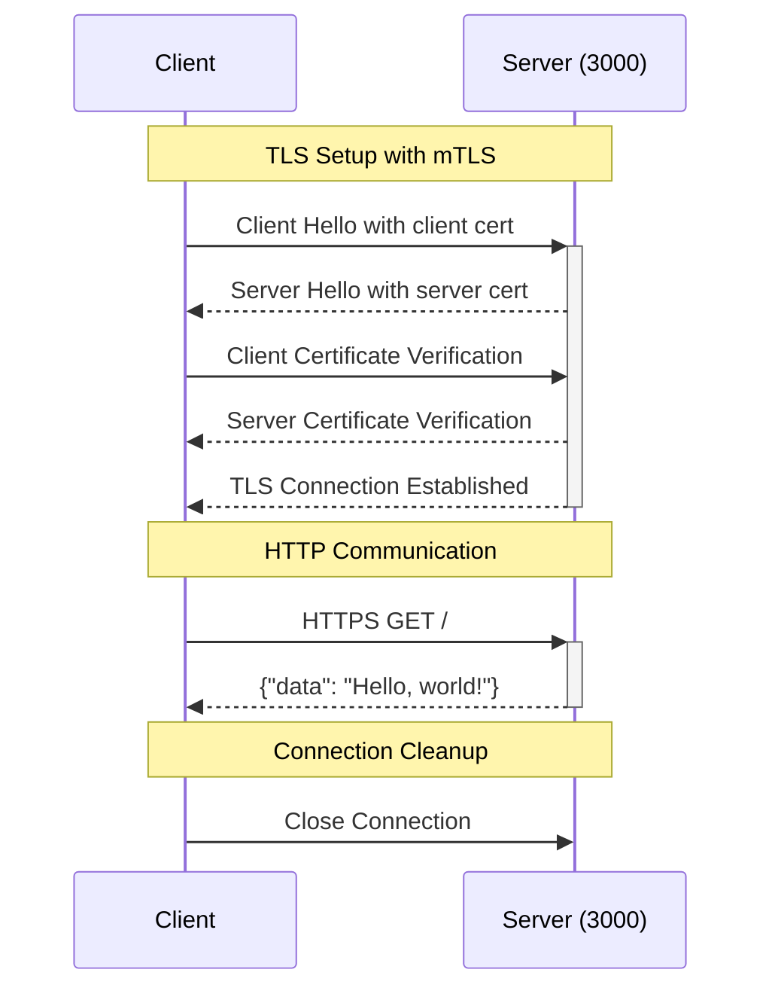
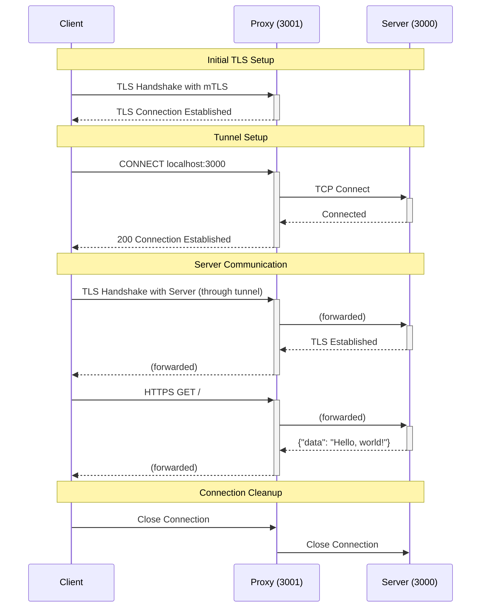

# mtls-node

mTLS example using using Node.js.

This example demonstrates how to set up mutual TLS (mTLS) authentication in a Node.js application. The example includes a client and a server, both of which are configured to use mTLS.

The repository also includes an HTTPS proxy server that demonstrates mTLS through a proxy tunnel.

## Prerequisites

- Node.js >= 22


### Understand the repository structure

The repository contains the following directories:

- `server`: Contains the server code that listens for incoming connections and requires mTLS authentication.
- `proxy`: Contains the proxy server code that forwards requests to the server through a tunnel.
- `client`: Contains the client code that connects direct to the server and requires mTLS authentication.
- `proxy-client`: Contains the client code that connects to the server through the proxy tunnel and requires mTLS authentication.
- `scripts`: Contains the script to generate the necessary certificates for mTLS.
- `certificates`: Contains the generated certificates used for mTLS authentication. (Dynamically generated by the script)

### Generate certificates

To generate the necessary certificates for mTLS, you can use the `generate-certs.sh` script provided in this repository. 

This script will create the following certificates in the `certificates` directory.

- Root CA, used as a trust anchor for both the clients, proxy and server.
- Server certificate, used by the server to authenticate itself to clients.
- Client certificate, used by the client and proxy client to authenticate itself to the server.
- Proxy certificate, used by the proxy to authenticate itself to the server.

```bash
./scripts/generate-certs.sh
```

### Install dependencies

The `install.sh` script will run `npm install` on all directories.

```bash
./scripts/install.sh
```

## Running the examples

### Example 1 - mTLS server and client

This example demonstrates a simple mTLS server and client. 

The server listens for incoming connections and requires mTLS authentication from the client.  If the authentication is successful, the server returns the requested data.



#### Start the server

```
node server
```

#### Run the client

```
node client
```

#### Output

If successful, you should see the data returned from the server in the output in the client console:

```
{ data: 'Hello, world!' }
```

### Example 2 - mTLS server and proxy client

This example extends example 1 by adding a proxy between the client and server.

The proxy server listens for incoming connections and creates a secure tunnel to the mTLS server. The proxy server also requires mTLS authentication from the client.



#### Start the server

```
node server
```

#### Start the proxy server

```
node proxy
```

#### Run the proxy client

```
node proxy-client
```

#### Output

If successful, you should see the data returned from the server in the output in the proxy client console:

```
{ data: 'Hello, world!' }
```
